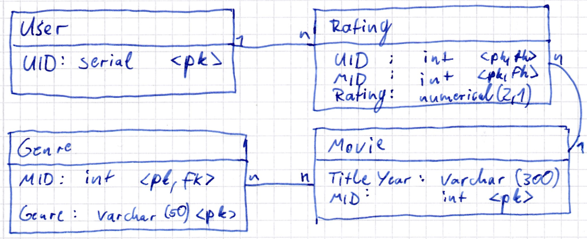
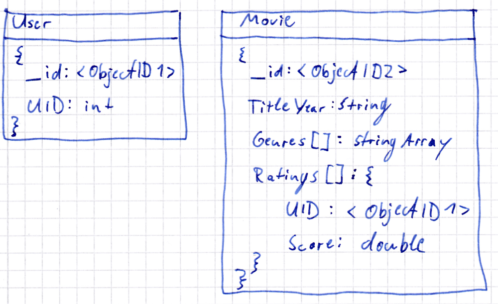

# BDT, Praktikumsbericht 1

Gruppe 21: Maximilian Neudert, Kai Pehns

---

## Aufgabe 1

### UML


Die Angaben wurden übernommen, wie gestellt. Es waren keine besonderen Anpassungen nötig.

### Relational



Fast direkte Übertragung des UML in das relationale Modell. Wichtig sind die Referenzen mit den Foreign Keys. Wir haben zur Modellierung die Entscheidung getroffen für die `Movie` Tabelle `Title` und `Year` in zwei Spalten zu trennen. Einfacherheitshalber wird aber erst eine `MovieYear` Spalte erstellt, damit der Datenimport einfacher ist und anschließend geteilt.

### NoSQL



Hier hatten wir bei der Übertragung des UML die Entscheidung zu treffen, ob wir die Ratings an das `User` oder an der `Movie` Dokument anhängen. Wir haben uns dazu entschieden die Ratings in das `Movie` Dokument zu integrieren, da es für Praktikum 2 notwendig ist, dass man zur Informationsgewinnung `Movie` iteriert. Dies hat zur Folge, dass das `User` Dokument sehr simpel ist.

## Aufgabe 2

Die Datei `movies.dat` enthält folgende Struktur

```bash
MovieID::Title::Genres
```

Zuerst haben wir festgestellt, dass `::` als Trennzeichen für die Spalten und `|` für Elemente in den Spalten genutzt wird. Dies ist später für den Import der Daten wichtig. Ansonsten gab es keine Unterschiede zur Modellierung.

Die Datei `ratings.dat` enthält die Bewertungen mit den gleichen Trennzeichen.

```bash
UserID::MovieID::Rating
```

Ein Unterschied zu der geplanten Modellierung ist, dass zusätzlich noch eine Spalte `Timestamp` existiert. Diese sollte dann noch für den Import in der SQL Datenbank erstellt werden.

## Aufgabe 3

### PostgreSQL

Wir sichten zuerst die Daten auf dem Server, diese liegen in einer nochmal anderen Form vor als die originalen Datensätze, was den Import aber einfacher macht.
Wir erstellen das Modell, indem wir folgende Query ausführen:

```sql
CREATE TABLE public.bdt_movie (
  mid integer primary key,
  titleyear varchar(300)
);
CREATE TABLE public.bdt_user (
  uid serial primary key
);
CREATE TABLE public.bdt_rating (
  uid integer NOT NULL,
  mid integer NOT NULL,
  rating smallint,
  PRIMARY KEY (mid,uid),
  CONSTRAINT mid_fk FOREIGN KEY (mid)
    REFERENCES public.bdt_movie (mid) MATCH FULL
    ON UPDATE NO ACTION ON DELETE NO ACTION,
  CONSTRAINT uid_fk FOREIGN KEY (uid)
    REFERENCES public.bdt_user (uid) MATCH FULL
    ON UPDATE NO ACTION ON DELETE NO ACTION
);
CREATE TABLE public.bdt_genre (
  mid integer NOT NULL,
  genre varchar(50) NOT NULL,
  PRIMARY KEY (mid,genre),
  CONSTRAINT mid_fk FOREIGN KEY (mid)
    REFERENCES public.bdt_movie (mid) MATCH FULL
    ON UPDATE NO ACTION ON DELETE NO ACTION
);
```

Anschließend erstellen wir ausreichend viele User und importieren wir die Daten mittels `\copy` (wegen user rights get der `copy` Befehl nicht):

```sql
insert into public.bdt_user values (generate_series(1,100000));

\copy public.bdt_movie FROM '/pgpool/movielens/adjusted/1m/movies.dat' with (format csv, delimiter ';');

\copy public.bdt_genre FROM '/pgpool/movielens/adjusted/1m/genres.dat' with (format csv, delimiter ';');

\copy public.bdt_rating FROM '/pgpool/movielens/adjusted/1m/ratings.dat' with (format csv, delimiter ';');
```

### MongoDB

Da MongoDB weniger Strukturvorbereitung verlangt fällt der Import einfacher aus:

```bash
mongoimport \
-u prak21 -p prak21 \
--db prak21 \
--collection movies \
--file /mnt/datasets/Movielens/JSON/movies_1m.json
```

### Couchbase

```bash
/opt/couchbase/bin/cbdocloader \
-u prak21 -p prak21 \
-b prak21 \
-n 127.0.0.1:8091 -v -m 100 \
/mnt/datasets/Movielens/couchbase/movies_1m.zip
```
