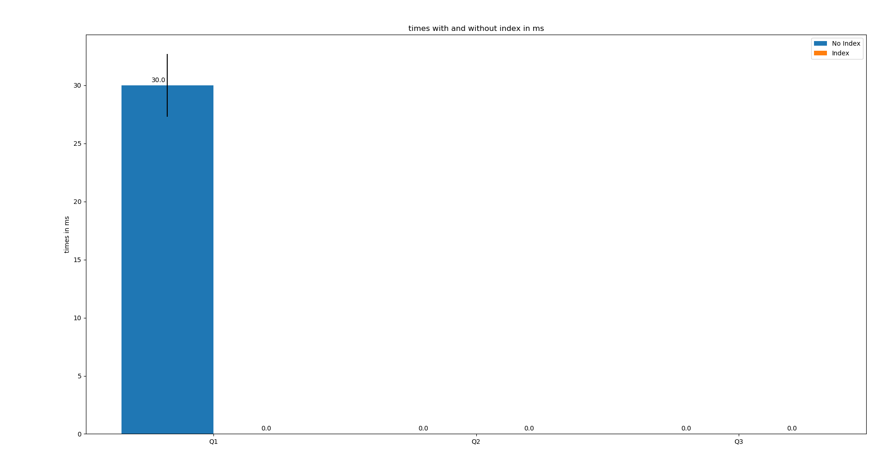
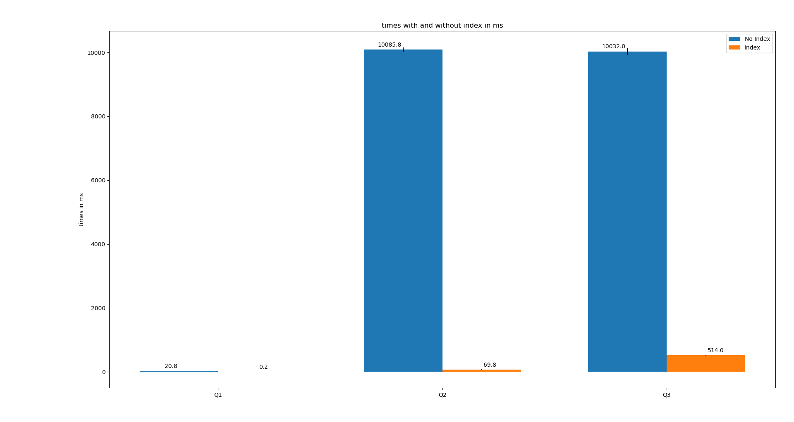

# BDT, Praktikumsbericht 3

Gruppe 21: Maximilian Neudert, Kai Pehns

---

## Vorbereitung

### Postgres

Da war erstmal nichts zu machen. Dennoch zur Erinnerung die alten postgres Befehle, die man auf `postgres.fbi.h-da.de` abgesetzt hat.

```sql
insert into public.user values (generate_series(1,1000000));

\copy public.movie FROM '/pgpool/movielens/adjusted/1m/movies.dat' with (format csv, delimiter ';');

\copy public.genre FROM '/pgpool/movielens/adjusted/1m/genres.dat' with (format csv, delimiter ';');

\copy public.rating FROM '/pgpool/movielens/adjusted/1m/ratings.dat' with (format csv, delimiter ';');
```

<div style="page-break-after: always;"></div>

### MongoDB

Wir loggen uns in [faircastle](faircastle.fbi.h-da.de) und öffnen die Mongo Shell.

```bash
mongo \
--username prak21 \
--password prak21 \
--authenticationDatabase prak21
```

Anschließend löschen wir die alte Collection

```javascript
use movies
db.movies.drop()
exit
```

und fügen die neuen Daten ein.

```bash
mongoimport \
-u prak21 -p prak21 \
--db prak21 \
--collection movies \
--file /mnt/datasets/Movielens/JSON/movies_20m.json
```

### Couchbase

Zuerst loggen wir uns in [silverhill-web](http://silverhill.fbi.h-da.de:8091/ui/index.html) ein und dann löschen wir die alten Dokumente über das web interface. Alternativ hätte auch folgendes Command funktioniert, wenn `enable-flush` gesetzt wäre.

```bash
couchbase-cli bucket-flush -c localhost:8091 -u prak21 -p prak21 --bucket=prak21
```

Danach loggen wir uns in [silverhill](silverhill.fbi.h-da.de) ein und importieren den `20m` Datensatz.

```bash
cbdocloader \
-u prak21 -p prak21 \
-b prak21 \
-c localhost:8091 \
-m 100 \
/mnt/datasets/Movielens/couchbase/movies_20m.zip
```

<div style="page-break-after: always;"></div>

## Aufgabe 1

### Couchbase

Wir nutzen folgende Queries für die Aufgabenstellung:

```sql
select title
from prak21
where title like '%Matrix%';

select ratings
from prak21
where movieId = 6365;

select title, ratings
from prak21
where movieId = 6365;
```

Und folgende Queries für Indizes:

```sql
create index movieIds on prak21(movieId);
create index titles on prak21(title);

drop index prak21.movieIds;
drop index prak21.titles;
```

Wir haben ein Python Script gebaut (Anhang 1), das die Queries (Hier `Q1`, `Q2`, `Q3`) 5 mal ausführt, die Zeiten sammelt (aus den `ExecutionStats`), Mittelwerte und Standardabweichung berechnet und das einmal ohne und einmal mit Index. Anschließend werden die Mittelwerte gegeneinander als Barchart geplottet und die Standardabweichung als schwarze Linie am Barende ergänzt. Die Zeiten sind in Millisekunden.
Wir hatten erst andere Zeiten und versucht uns diese zu erklären, aber diese stellten sich als inkorrekt heraus. Ursache war, dass beim Versuch einen Index über die API zu erstellen jede Query innerhalb von 75 Sekunden terminiert wird. Der Index wurde dann zwar angelegt, nur nicht vollständig, weshalb dieser im Bucket status auch gelistet wurde.


Man sieht, dass ein Index zu einer deutlichen Verbesserung bei allen 3 Queries führt.
Man sieht auch, dass Couchbase grundsätzlich alles durchsucht anhand der Tatsache, dass die Initialqueries alle etwa gleich schnell sind, aber mit Index die Fulltext-Search deutlich länger benötigt als reine Zugriffe auf Ids mittels Index.

<div style="page-break-after: always;"></div>

### MongoDB

Wir nutzen folgende Queries für die Aufgabenstellung:

```javascript
db.movies.find({ title: { $regex: "Matrix" } }, { title: 1 });

db.movies.find({ _id: 6365 }, { ratings: 1 });

db.movies.find({ _id: 6365 }, { title: 1, ratings: 1 });
```

Analog zu Couchbase wieder ein Script (Anhang 2), welches uns folgende Ergebnisse liefert mit Zeiten in Millisekunden:



Wir stellen zuerst fest, dass MongoDB deutlich schneller als Couchbase ist und, dass der Standard Optimizer von MongoDB auch sehr gut arbeitet.
Die Queries sind so schnell, dass als `executionTimeMillis` 0ms ausgegeben werden. Bei den ersten Versuchen am Wochenende waren die Zeiten im 100er ms Bereich. Wir waren deshalb verwirrt, haben die Daten überprüft, aber an sich stimmt alles. Dies macht auch Sinn, da MongoDB standardgemäß einen Index auf `_id` hat und deswegen für eine Suche mittels `_id` die nötige Rechenzeit unmessbar gering ist.
Legt man zusätzlich einen Text Index auf `title` an, so wird auch Q1 in den unmessbaren Bereich beschleunigt.
Wir schätzen, dass am Wochenende mehr Last auf dem Server war und es deshalb zur Abweichung kam.

<div style="page-break-after: always;"></div>

## Aufgabe 2

Wir laden die referentiellen Daten.

```bash
mongoimport \
-u prak21 -p prak21 \
--db prak21 \
--collection moviesref \
--file /mnt/datasets/Movielens/JSONref/20m/movies.json

mongoimport \
-u prak21 -p prak21 \
--db prak21 \
--collection genres \
--file /mnt/datasets/Movielens/JSONref/20m/genres.json

mongoimport \
-u prak21 -p prak21 \
--db prak21 \
--collection ratings \
--file /mnt/datasets/Movielens/JSONref/20m/ratings.json
```

Und wir benutzen folgende Queries.

```javascript
db.moviesref.find({title: { $regex: "Matrix" }}, { title: 1 });

db.ratings.find({ movieId: 6365 });

db.moviesref.aggregate([{
  $match: {
    movieId: 6365
  }
},{
  $lookup: {
    from: "ratings",
    localField: "movieId",
    foreignField: "movieId",
    as: "ratings"
  }
},{
  $project: {
    title: true,
    ratings: true
  }
}]);
```

<div style="page-break-after: always;"></div>

Anschließend gehen wir wieder größtenteils analog vor. Es ist aber eine Anpassung nötig, da `aggregate` keine `executionStats` unterstützt und zwar wird die Zeit dann in Python mittels `time` als Differenz in Millisekunden gemessen.



Für Q1 ändert sich in Vergleich zu Embedded praktisch nichts, folglich das Ergebnis. Anders für Ratings und die Aggregation mit Ratings. Hier hat MongoDB per Standard kein Index, auf dem dieser Arbeiten kann, wodurch die Zeiten ähnlich der von Couchbase sind. Ein Index beschleunigt die Queries dann aber deutlich.

Da die Filme und ihre Titel bei beiden Modellierungsansätzen gleich aussehen gibt es keine Unterschiede in der Betrachtung der ersten Query.
Bei der zweiten Query ist der hauptsächliche Unterschied, dass automatische Indizes nur auf `_id` erstellt werden, weswegen die optimierungslose Betrachtung in Aufgabe 1 bereits sehr schnell war. Diesen Index müssen wir erst noch auf `movieId` erstellen.
Das gleiche Problem existiert in der dritten Query. Zusätzlich muss dort, aufgrund der referentiellen Modellierung, noch ein Join durchgeführt werden, welcher die Performance und die Anfragenkomplexität negativ beeinflusst.

Somit sollte eine embedded Modellierung vermutlich sinnvoller sein, falls häufig eine Beziehung zwischen Movies und Ratings besteht, während dies negative Auswirkung hätte wenn man Ratings pro User betrachtet.
Falls also beide Betrachtungsweisen ähnlich oft geschehen könnte es sinnvoller sein die referentielle Modellierung zu verwenden. Alternativ könnte man natürlich die Ratings auch Embeddedd in User-Dokumente speichern, als dritte Option, falls das die Betrachtungsweise ist, die am häufigsten nützlich ist.


<div style="page-break-after: always;"></div>

## Anhang 1

```python
#!/usr/bin/python3

import numpy as np
import matplotlib.pyplot as plt

####
# Couchbase
####

import couchbase
from couchbase.cluster import Cluster
from couchbase.cluster import PasswordAuthenticator
from couchbase.n1ql import N1QLQuery

# login

cluster = Cluster('couchbase://silverhill.fbi.h-da.de')
authenticator = PasswordAuthenticator('prak21', 'prak21')
cluster.authenticate(authenticator)
cb = cluster.open_bucket('prak21')
cb.n1ql_timeout = 3600

# analyze functions


def cb_index_create():
  q1 = 'create index movieIds on prak21(movieId);'
  q2 = 'create index titles on prak21(title);'
  query_result(q1)
  query_result(q2)


def cb_index_drop():
  q1 = N1QLQuery('drop index prak21.movieIds;')
  q2 = N1QLQuery('drop index prak21.titles;')
  try:
    cb.n1ql_query(q1).execute()
  except couchbase.exceptions.HTTPError:
    pass
  try:
    cb.n1ql_query(q2).execute()
  except couchbase.exceptions.HTTPError:
    pass


def query_result(string_query):
  q = N1QLQuery(string_query)
  q.timeout = 3600
  qres = cb.n1ql_query(q)
  for row in qres:
    print(row)


def query_time(string_query, repetitions):
  times = []
  q = N1QLQuery(string_query)
  q.timeout = 3600
  for _ in range(repetitions):
    qres = cb.n1ql_query(q).execute()
    time = qres.metrics['executionTime']
    # extract time we get times like 'x.xxs' or 'x.xxms'
    # s is seconds, ms is milliseconds
    format_letter = time[-2]
    if format_letter == 'm':
      times.append(round(float(time[:-2]), 2))
    else:
      times.append(round(float(time[:-1]) * 1000, 2))
  times = np.array(times)
  time_avg = np.round(np.mean(times), 0)
  time_std = np.round(np.std(times), 0)
  return(time_avg, time_std)

####
# Aufgabe 1
####


# run queries and collect times
n = 5
q1 = "select title from prak21 where title like '%Matrix%';"
q2 = "select ratings from prak21 where movieId = 6365;"
q3 = "select title, ratings from prak21 where movieId = 6365;"
cb_index_drop()
t1, std1 = query_time(q1, n)
t2, std2 = query_time(q2, n)
t3, std3 = query_time(q3, n)
times_noidx = np.array([t1, t2, t3])
std_noidx = np.array([std1, std2, std3])
cb_index_create()
t4, std4 = query_time(q1, n)
t5, std5 = query_time(q2, n)
t6, std6 = query_time(q3, n)
times_idx = np.array([t4, t5, t6])
std_idx = np.array([std4, std5, std6])

# visualize
ind = np.arange(len(times_noidx))  # the x locations for the groups
width = 0.35  # the width of the bars

fig, ax = plt.subplots()
rects1 = ax.bar(ind - width/2, times_noidx, width,
                yerr=std_noidx, label='No Index')
rects2 = ax.bar(ind + width/2, times_idx, width, yerr=std_idx, label='Index')

# Add some text for labels, title and custom x-axis tick labels, etc.
ax.set_ylabel('times in ms')
ax.set_title('times with and without index in ms')
ax.set_xticks(ind)
ax.set_xticklabels(('Q1', 'Q2', 'Q3'))
ax.legend()


def autolabel(rects, xpos='center'):
  ha = {'center': 'center', 'right': 'left', 'left': 'right'}
  offset = {'center': 0, 'right': 1, 'left': -1}

  for rect in rects:
    height = rect.get_height()
    ax.annotate('{}'.format(height),
                xy=(rect.get_x() + rect.get_width() / 2, height),
                xytext=(offset[xpos]*3, 3),  # use 3 points offset
                textcoords="offset points",  # in both directions
                ha=ha[xpos], va='bottom')


autolabel(rects1, "left")
autolabel(rects2, "right")

fig.tight_layout()

plt.show(block=True)

```

<div style="page-break-after: always;"></div>

## Anhang 2

```python
#!/usr/bin/python3

import numpy as np
import matplotlib.pyplot as plt

####
# MonoDB
####

import pymongo

# login

client = pymongo.MongoClient(
    "mongodb://faircastle.fbi.h-da.de",
    username='prak21',
    password='prak21',
    authSource='prak21'
)

# analyze functions


def mongo_idx_drop():
  with client:
    db = client.prak21
    try:
      db.movies.drop_index('idx_title')
    except pymongo.errors.OperationFailure:
      pass
    try:
      db.moviesref.drop_index('idx_title')
    except pymongo.errors.OperationFailure:
      pass
    try:
      db.moviesref.drop_index('idx_movieid')
    except pymongo.errors.OperationFailure:
      pass
    try:
      db.ratings.drop_index('idx_movieid')
    except pymongo.errors.OperationFailure:
      pass


def mongo_idx_create():
  with client:
    db = client.prak21
    db.movies.create_index(
        [('title', pymongo.TEXT)],
        name='idx_title', default_language='english')
    db.moviesref.create_index(
        [('title', pymongo.TEXT)],
        name='idx_title', default_language='english')
    db.moviesref.create_index(
        [('movieId', pymongo.ASCENDING)],
        name='idx_movieid')
    db.ratings.create_index(
        [('movieId', pymongo.ASCENDING)],
        name='idx_movieid')


def query_result(collection, dict_query):
  with client:
    db = client.prak21
    col = db[collection]
    qres = col.find(dict_query)
    for x in qres:
      print(x)


def query_time(collection, dict_query, dict_select, repetitions):
  times = []
  for _ in range(repetitions):
    with client:
      db = client.prak21
      col = db[collection]
      qres = col.find(dict_query, dict_select).explain()
      stats = qres["executionStats"]
      time = stats["executionTimeMillis"]
      times.append(time)
  times = np.array(times)
  time_avg = np.round(np.mean(times), 0)
  time_std = np.std(times)
  return(time_avg, time_std)

####
# Aufgabe 1
####


# run queries and collect times
n = 5
q1 = {"title": {"$regex": "Matrix"}}
q12 = {"$text": {"$search": "Matrix"}}
s1 = {"title": 1}
q2 = {"_id": 6365}
s2 = {"ratings": 1}
q3 = {"_id": 6365}
s3 = {"title": 1, "ratings": 1}
mongo_idx_drop()
t1, std1 = query_time('movies', q1, s1, n)
t2, std2 = query_time('movies', q2, s2, n)
t3, std3 = query_time('movies', q3, s3, n)
times_noidx = np.array([t1, t2, t3])
std_noidx = np.array([std1, std2, std3])
print(times_noidx)
print(std_noidx)
mongo_idx_create()
t4, std4 = query_time('movies', q12, s1, n)
t5, std5 = query_time('movies', q2, s2, n)
t6, std6 = query_time('movies', q3, s3, n)
times_idx = np.array([t4, t5, t6])
std_idx = np.array([std4, std5, std6])
print(times_idx)
print(std_idx)

# visualize
ind = np.arange(len(times_noidx))  # the x locations for the groups
width = 0.35  # the width of the bars

fig, ax = plt.subplots()
rects1 = ax.bar(ind - width/2, times_noidx, width,
                yerr=std_noidx, label='No Index')
rects2 = ax.bar(ind + width/2, times_idx, width, yerr=std_idx, label='Index')

# Add some text for labels, title and custom x-axis tick labels, etc.
ax.set_ylabel('times in ms')
ax.set_title('times with and without index in ms')
ax.set_xticks(ind)
ax.set_xticklabels(('Q1', 'Q2', 'Q3'))
ax.legend()


def autolabel(rects, xpos='center'):
  ha = {'center': 'center', 'right': 'left', 'left': 'right'}
  offset = {'center': 0, 'right': 1, 'left': -1}

  for rect in rects:
    height = rect.get_height()
    ax.annotate('{}'.format(height),
                xy=(rect.get_x() + rect.get_width() / 2, height),
                xytext=(offset[xpos]*3, 3),  # use 3 points offset
                textcoords="offset points",  # in both directions
                ha=ha[xpos], va='bottom')


autolabel(rects1, "left")
autolabel(rects2, "right")

fig.tight_layout()

plt.show(block=True)

```

<div style="page-break-after: always;"></div>

## Anhang 3

```python
#!/usr/bin/python3

import numpy as np
import matplotlib.pyplot as plt
from time import time as now

####
# MonoDB
####

import pymongo

# login

client = pymongo.MongoClient(
    "mongodb://faircastle.fbi.h-da.de",
    username='prak21',
    password='prak21',
    authSource='prak21'
)

# analyze functions


def mongo_idx_drop():
  with client:
    db = client.prak21
    try:
      db.movies.drop_index('idx_title')
    except pymongo.errors.OperationFailure:
      pass
    try:
      db.moviesref.drop_index('idx_title')
    except pymongo.errors.OperationFailure:
      pass
    try:
      db.moviesref.drop_index('idx_movieid')
    except pymongo.errors.OperationFailure:
      pass
    try:
      db.ratings.drop_index('idx_movieid')
    except pymongo.errors.OperationFailure:
      pass


def mongo_idx_create():
  with client:
    db = client.prak21
    db.movies.create_index(
        [('title', pymongo.TEXT)],
        name='idx_title', default_language='english')
    db.moviesref.create_index(
        [('title', pymongo.TEXT)],
        name='idx_title', default_language='english')
    db.moviesref.create_index(
        [('movieId', pymongo.ASCENDING)],
        name='idx_movieid')
    db.ratings.create_index(
        [('movieId', pymongo.ASCENDING)],
        name='idx_movieid')


def query_result(collection, dict_query):
  with client:
    db = client.prak21
    col = db[collection]
    qres = col.find(dict_query)
    for x in qres:
      print(x)


def query_time(collection, dict_query, dict_select, repetitions):
  times = []
  for _ in range(repetitions):
    with client:
      db = client.prak21
      col = db[collection]
      if dict_select:
        qres = col.find(dict_query, dict_select).explain()
      else:
        qres = col.find(dict_query, dict_select).explain()
      stats = qres["executionStats"]
      time = stats["executionTimeMillis"]
      times.append(time)
  times = np.array(times)
  time_avg = np.mean(times)
  time_std = np.std(times)
  return(time_avg, time_std)


def queryagg_time(collection, pipeline, repetitions):
  times = []
  for _ in range(repetitions):
    with client:
      db = client.prak21
      t = int(round(now() * 1000))
      db.command('aggregate', collection,
                 pipeline=pipeline, explain=False)
      t = int(round(now() * 1000)) - t
      times.append(t)
  times = np.array(times)
  time_avg = np.round(np.mean(times), 0)
  time_std = np.std(times)
  return(time_avg, time_std)

####
# Aufgabe 1
####


# run queries and collect times
n = 5
q1 = {"title": {"$regex": "Matrix"}}
q12 = {"$text": {"$search": "Matrix"}}
s1 = {"title": 1}
q2 = {"movieId": 6365}
dic1 = {"$match": {"movieId": 6365}}
dic2 = {"$lookup": {		"from": "ratings",	"localField": "movieId",
                      "foreignField": "movieId", "as": "ratings"	}}
dic3 = {"$project": {"title": True,   "ratings": "true"}}
pipeline = [dic1, dic2, dic3]
mongo_idx_drop()
t1, std1 = query_time('moviesref', q1, s1, n)
t2, std2 = query_time('ratings', q2, False, n)
t3, std3 = queryagg_time('moviesref', pipeline, n)
times_noidx = np.array([t1, t2, t3])
std_noidx = np.array([std1, std2, std3])
mongo_idx_create()
t4, std4 = query_time('moviesref', q12, s1, n)
t5, std5 = query_time('ratings', q2, False, n)
t6, std6 = queryagg_time('moviesref', pipeline, n)
times_idx = np.array([t4, t5, t6])
std_idx = np.array([std4, std5, std6])

# visualize
ind = np.arange(len(times_noidx))  # the x locations for the groups
width = 0.35  # the width of the bars

fig, ax = plt.subplots()
rects1 = ax.bar(ind - width/2, times_noidx, width,
                yerr=std_noidx, label='No Index')
rects2 = ax.bar(ind + width/2, times_idx, width, yerr=std_idx, label='Index')

# Add some text for labels, title and custom x-axis tick labels, etc.
ax.set_ylabel('times in ms')
ax.set_title('times with and without index in ms')
ax.set_xticks(ind)
ax.set_xticklabels(('Q1', 'Q2', 'Q3'))
ax.legend()


def autolabel(rects, xpos='center'):
  ha = {'center': 'center', 'right': 'left', 'left': 'right'}
  offset = {'center': 0, 'right': 1, 'left': -1}

  for rect in rects:
    height = rect.get_height()
    ax.annotate('{}'.format(height),
                xy=(rect.get_x() + rect.get_width() / 2, height),
                xytext=(offset[xpos]*3, 3),  # use 3 points offset
                textcoords="offset points",  # in both directions
                ha=ha[xpos], va='bottom')


autolabel(rects1, "left")
autolabel(rects2, "right")

fig.tight_layout()

plt.show(block=True)

```
